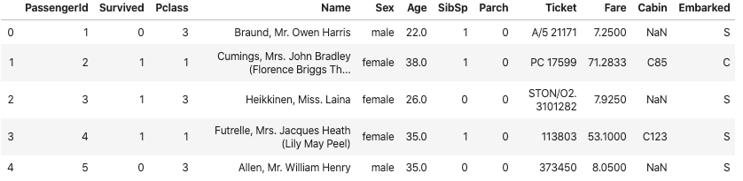
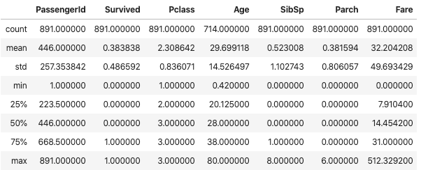
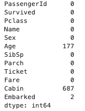
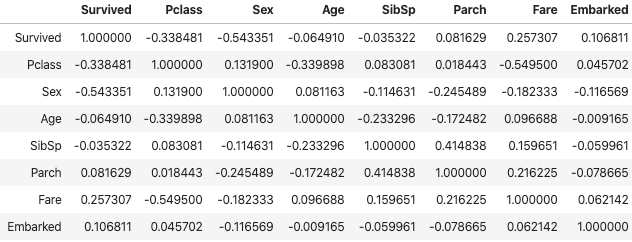
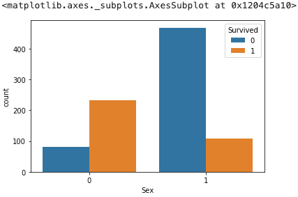
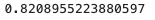
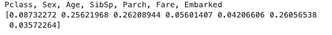

今年はKaggleのコンペに参加すべく、まずはtitanicから始めてみました。

手順については以下の記事が参考になりました。

[機械学習を仕事に使うには？ 03\_Pythonのコーディング手順を全公開 \- Qiita](https://qiita.com/Saku731/items/7f444e1312b85996842f)


### トレーニングデータ読み込み

以下のページからtrain.csvをダウンロードします。

[Titanic: Machine Learning from Disaster \| Kaggle](https://www.kaggle.com/c/titanic/data)

pandas.DataFrameに読み込みます。

```python
# ライブラリのインポート
import pandas as pd
import matplotlib.pyplot as plt
import seaborn as sns
%matplotlib inline

# トレーニングデータ読み込み
df = pd.read_csv('./train.csv')

# データ表示(一部)
df.head()
```




#### 変数の説明

train.csvをダウンロードしたページにあるData Dictionaryを参照します。

titanicタスクの場合、Survivalが目的変数、それ以外が説明変数になります。

| **Variable** | **Definition**                             | Key                                            |
| ------------ | ------------------------------------------ | ---------------------------------------------- |
| survival     | Survival                                   | 0 = No, 1 = Yes                                |
| pclass       | Ticket class                               | 1 = 1st, 2 = 2nd, 3 = 3rd                      |
| sex          | Sex                                        |                                                |
| Age          | Age in years                               |                                                |
| sibsp        | # of siblings / spouses aboard the Titanic |                                                |
| parch        | # of parents / children aboard the Titanic |                                                |
| ticket       | Ticket number                              |                                                |
| fare         | Passenger fare                             |                                                |
| cabin        | Cabin number                               |                                                |
| embarked     | Port of Embarkation                        | C = Cherbourg, Q = Queenstown, S = Southampton |

変数の概要を調べます。

データのバラツキなどを見る時に使います。titanicの生き残った人より死んだ人の方が多かったことがわかります。

```python
# 説明変数の概要を調べる
df.describe()
```




### データクレンジング

欠損したデータの対応が、データクレンジングと呼ばれます。


まずは、データの欠損有無を調べます。

```
# データの欠損有無
df.isnull().sum()
```




欠損値がある場合、1)データを削除する、2)特定の値を設定する方法があります。今回は平均値を設定しました。また、後述の分類（ランダムフォレスト）を実施するためには数値でない変数は使えないので、Cabin、Name、PassengerId、Ticketは説明変数から削除しました。

```python
# 欠損値処理
# 平均値をセットする
df['Fare'] = df['Fare'].fillna(df['Fare'].median())
df['Age'] = df['Age'].fillna(df['Age'].median())
df['Embarked'] = df['Embarked'].fillna('S')

# カテゴリ変数の変換
df['Sex'] = df['Sex'].apply(lambda x: 1 if x == 'male' else 0)
df['Embarked'] = df['Embarked'].map( {'S': 0, 'C': 1, 'Q': 2} ).astype(int)

# 不要な変数削除
df = df.drop(['Cabin','Name','PassengerId','Ticket'],axis=1)
```


変数の相関を調べます。

生存(Survival)に強く関連する説明変数が旅客クラス(Pclass)、性別(Sex)、料金(Fare)であることがわかります。

```python
# 説明変数の相関を調べる
df.corr()
```




#### データの可視化

可視化ライブラリ(seaborn)を使うとデータに対する理解が深まります。

```python
# データ可視化
sns.countplot('Sex',hue='Survived',data=df)
```




### 機械学習

#### データの準備

* トレーニングデータ(説明変数)から目的変数(生存データ)を削除します。

* 生存データを目的変数とします。
* データの70%を使ってトレーニングを行い、残りの30%で精度評価します。

```python
# https://www.randpy.tokyo/entry/python_random_forest
from sklearn.model_selection import train_test_split

# 説明変数(train_X)と結果に分割(train_y)
train_X = df.drop('Survived', axis=1)
train_y = df.Survived

# トレーニングデータとテストデータ（精度計測用）に分割
# https://docs.pyq.jp/python/machine_learning/tips/train_test_split.html
# test_size: テストデータのサイズ。トレーニングデータのサイズは1-テストデータのサイズ
# random_state: 乱数発生のシード。未指定の場合にはnp.randomが用いられる
(train_X, test_X ,train_y, test_y) = train_test_split(train_X, train_y, test_size = 0.3, random_state = 666)

```


#### 分類

分類モデルはランダムフォレストを使ってみます。約82%の精度が得られました。

```python
# ランダムフォレスト
# https://ja.wikipedia.org/wiki/%E3%83%A9%E3%83%B3%E3%83%80%E3%83%A0%E3%83%95%E3%82%A9%E3%83%AC%E3%82%B9%E3%83%88
from sklearn.ensemble import RandomForestClassifier
clf = RandomForestClassifier(n_estimators=100, random_state=0)
clf = clf.fit(train_X, train_y)
pred = clf.predict(test_X)

# 精度計算
from sklearn.metrics import (roc_curve, auc, accuracy_score)
fpr, tpr, thresholds = roc_curve(test_y, pred, pos_label=1)
auc(fpr, tpr)
accuracy_score(pred, test_y)
```




特徴量の影響度を調べます。


性別(Sex)、年齢(Age)、料金(Fare)の影響が強かったことがわかります。データの相関では旅客クラス(Pclass)が高かったのですが、このデータは料金(Fare)と関連があるため、年齢の影響が強くなったのだと考えられます。

```python
# 特徴量の影響度
fti = clf.feature_importances_ 
print('Pclass, Sex, Age, SibSp, Parch, Fare, Embarked')
print(fti)
```



### 参考

* [【Pythonで決定木 & Random Forest】タイタニックの生存者データを分析してみた \- Np\-Urのデータ分析教室](https://www.randpy.tokyo/entry/python_random_forest)
* [機械学習を仕事に使うには？ 03\_Pythonのコーディング手順を全公開 \- Qiita](https://qiita.com/Saku731/items/7f444e1312b85996842f)
* [タイタニック号の乗客の生存予測〜80%以上の予測精度を超える方法（探索的データ解析編） \| キヨシの命題](https://yolo-kiyoshi.com/2018/12/16/post-951/)